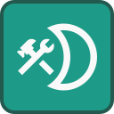

# CraftMoon

Creative 3D platform made in the Godot Engine.

### How to Play

[Download the launcher](https://github.com/gb2dev/CraftMoonLauncher/releases/latest) to automatically play the latest version of the game.

### How to Edit this Project in Godot to Contribute
1. [Clone the ModIO GDExtension and build it using cargo](https://github.com/gb2dev/modio-godot) (debug build `cargo build` for editing project in Godot editor, release build `cargo build --release` for exported project).
2. - Windows: Copy `target/debug/mod_io.dll` to `addons/modio/win/mod_io.debug.x64.dll` and `target/release/mod_io.dll` to `addons/modio/win/mod_io.x64.dll`.
   - Linux: Copy `target/debug/libmod_io.so` to `addons/modio/linux/libmod_io.debug.x64.so` and `target/release/libmod_io.so` to `addons/modio/linux/libmod_io.x64.so`.
3. Launch Godot and open the project.
